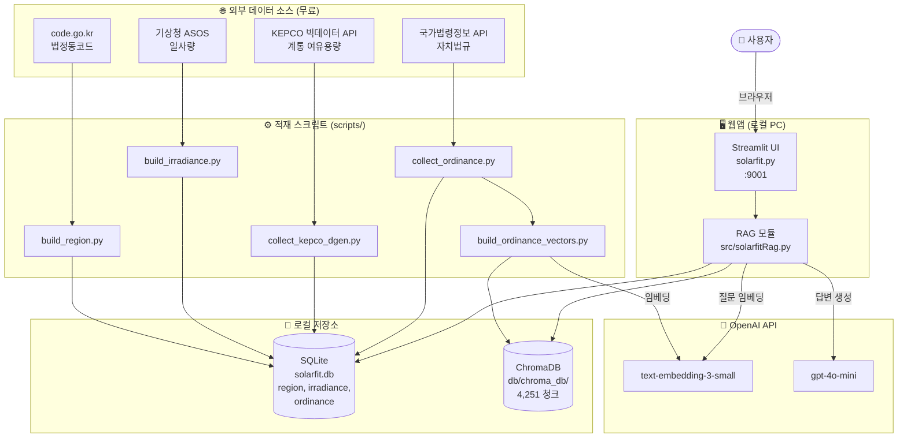
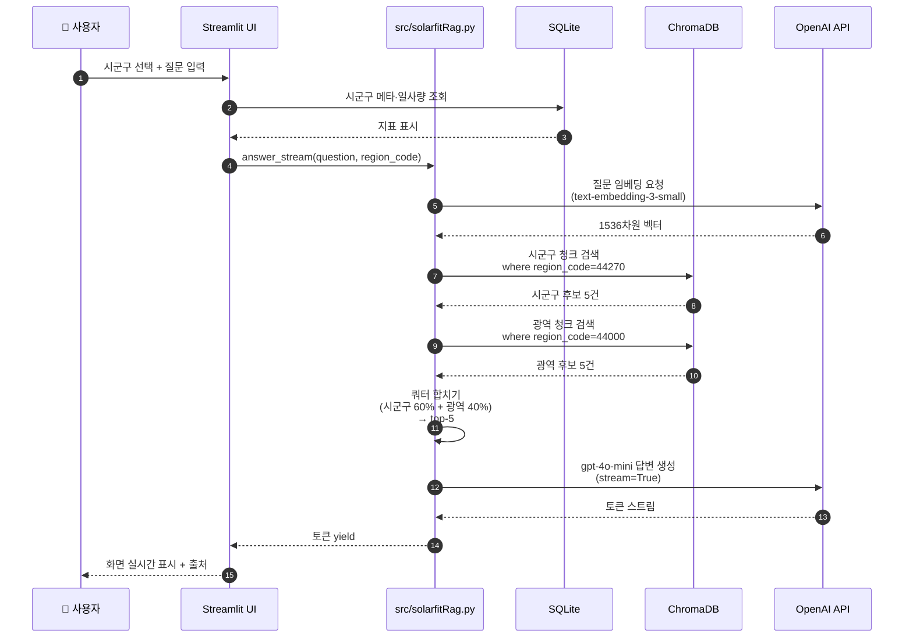
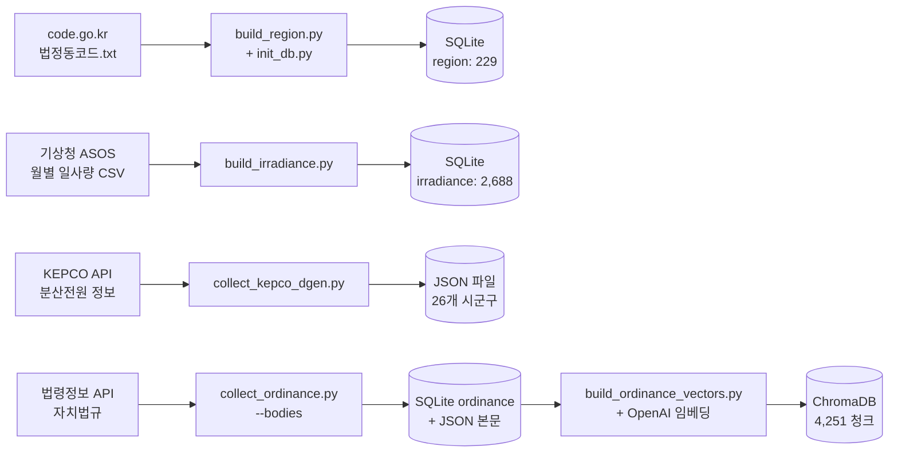
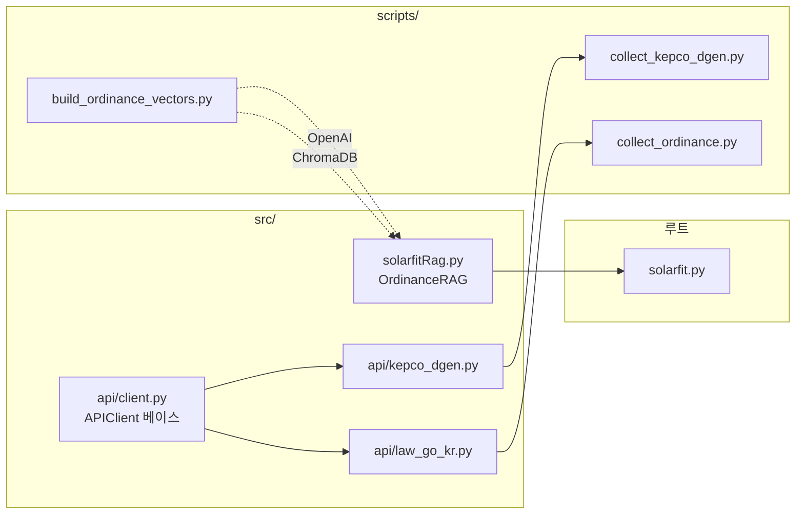
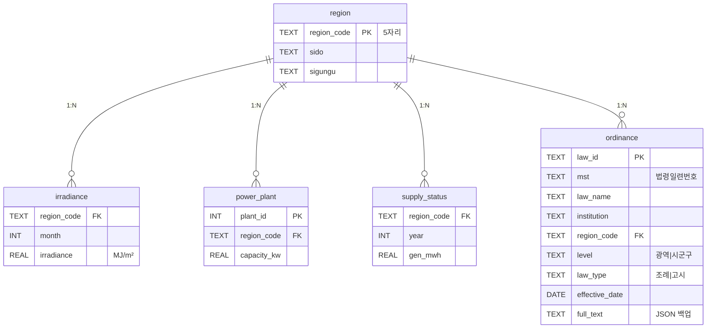

# 솔라스팟 시스템 아키텍처

> 구조도·RAG 흐름·모델 선택·데이터 스키마 정리.
> 발표 자료에 재사용 가능 (Mermaid 코드 그대로 노션·슬라이드에 붙여넣기).

---

## 1. 전체 아키텍처 (3계층)



---

## 2. RAG 조회 흐름 (질문 → 답변)



### 핵심 — 시군구 쿼터 분배

| 항목 | 단순 RAG | **우리 방식** |
|------|---------|-------------|
| 검색 방식 | top-5 한 번에 | 시군구·광역 따로 검색 |
| 순위 기준 | distance 단순 정렬 | 시군구 60% 강제 + 거리 정렬 |
| 결과 | 광역 위주 (시군구 누락) | 시군구 자체 조례 항상 포함 |

코드 위치: `src/solarfitRag.py` `OrdinanceRAG.search()`

---

## 3. 적재 파이프라인 (배치 흐름)



---

## 4. 모듈 의존성



---

## 5. 데이터 스키마 (SQLite)



---

## 6. ChromaDB 청크 메타데이터

각 청크에 부착되는 메타:

```json
{
    "region_code": "44270",
    "sido": "충청남도",
    "sigungu": "당진시",
    "institution": "충청남도 당진시",
    "level": "시군구",
    "law_id": "2050xxx",
    "law_name": "당진시 공영주차장 신·재생에너지 발전설비 조례",
    "law_type": "조례",
    "mst": "1487xxx",
    "article_num": "000500",
    "article_title": "다른 조례와의 관계"
}
```

검색 시 메타 필터:
- `where={"region_code": "44270"}` — 당진시만
- `where={"$and": [{"region_code":"44000"}, {"level":"광역"}]}` — 충청남도 광역만

---

## 7. 모델 선택 — Before vs After

원래 계획 (HANDOFF.md) → OpenAI 키 확보 후 단순화:

### Before (캐글 자체 운영)
| 구분 | 모델 | 위치 | GPU |
|------|------|------|-----|
| 임베딩 | `ko-sroberta-multitask` (HF) | 캐글 (1회성) | T4 |
| LLM | `EXAONE 3.5` / `Qwen2.5` (Ollama) | 캐글 (매 질문) | T4 상시 |
| 연결 | Cloudflare Tunnel | - | - |

### After (현재)
| 구분 | 모델 | 위치 | GPU |
|------|------|------|-----|
| 임베딩 | **`text-embedding-3-small`** | OpenAI 서버 | 불필요 |
| LLM | **`gpt-4o-mini`** | OpenAI 서버 | 불필요 |
| 연결 | HTTPS API | - | - |

### 변화 요약
- 캐글·Ollama·Tunnel 모두 **제거**
- 응답 속도 3~5초 → **1~2초**
- 운영 복잡도 ↓ / 안정성 ↑
- 1주 데모 비용: 무료 → 약 **200원**

---

## 8. 사용 모델 상세

| 영역 | 모델 | 차원/특성 | 비용 |
|------|------|----------|------|
| 임베딩 | `text-embedding-3-small` | 1536차원, OpenAI | $0.02/1M tokens |
| LLM | `gpt-4o-mini` | 스트리밍, 128K 컨텍스트 | $0.15/$0.60 per 1M |
| 벡터 인덱스 | ChromaDB HNSW | 코사인 유사도 | 무료 (로컬) |

질문 1회당:
- 임베딩 호출 1회 (~0.001원)
- LLM 호출 1회 입력 ~2,000 + 출력 ~300 토큰 (~0.9원)
- **합 약 0.9원/질문**

---

## 9. 인프라 비교 (Before/After 인포그래픽용)

```
Before                       After
─────────                    ─────
[캐글 노트북]                  [내 PC]
  ├─ Ollama 서버 (GPU)          ├─ Streamlit
  ├─ 모델 다운 ~500MB           ├─ ChromaDB (로컬)
  └─ Cloudflare Tunnel          └─ SQLite (로컬)
       ↓ 터널 URL                   ↓ HTTPS
[내 PC]                       [OpenAI 서버]
  └─ Streamlit                  ├─ 임베딩 모델
  └─ ChromaDB                    └─ gpt-4o-mini
```

---

## 10. 발표 자료 활용 가이드

| 슬라이드 | 사용 다이어그램 |
|---------|---------------|
| 시스템 아키텍처 | §1 전체 아키텍처 |
| RAG 흐름 | §2 시퀀스 다이어그램 |
| 데이터 적재 | §3 파이프라인 |
| 데이터 스키마 | §5 ER 다이어그램 |
| 모델 선택 어필 | §7 Before/After 표 |
| 시군구 쿼터 차별화 | §2 핵심 박스 |

→ Mermaid 코드 그대로 노션·Mermaid Live Editor에 붙여 PNG export 가능.

---

## 11. 한 줄 요약 (노션·발표 표지용)

> "공공 API 4종 → SQLite + ChromaDB 이중 저장 → OpenAI 임베딩·LLM 기반 RAG. 시군구·광역 쿼터 분배로 지역 특수성 보존. 로컬 PC + 인터넷만으로 동작, 1주 비용 200원."
